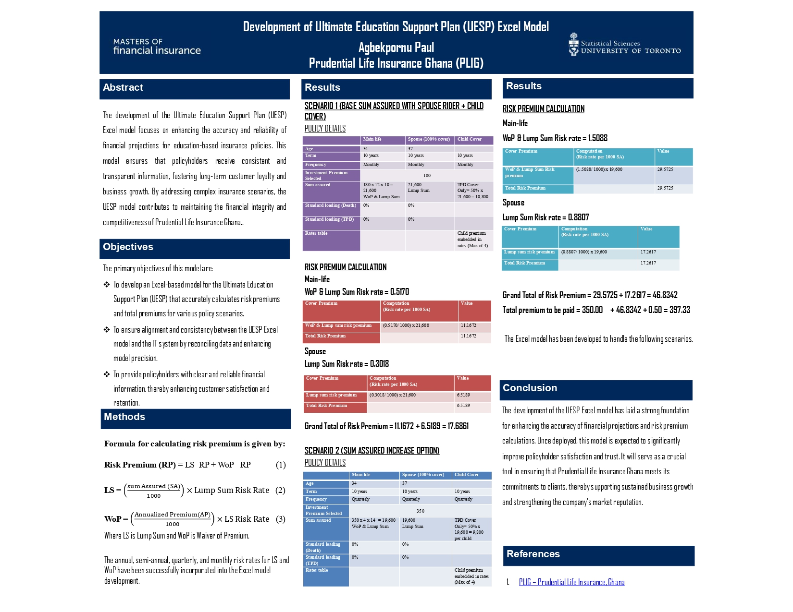
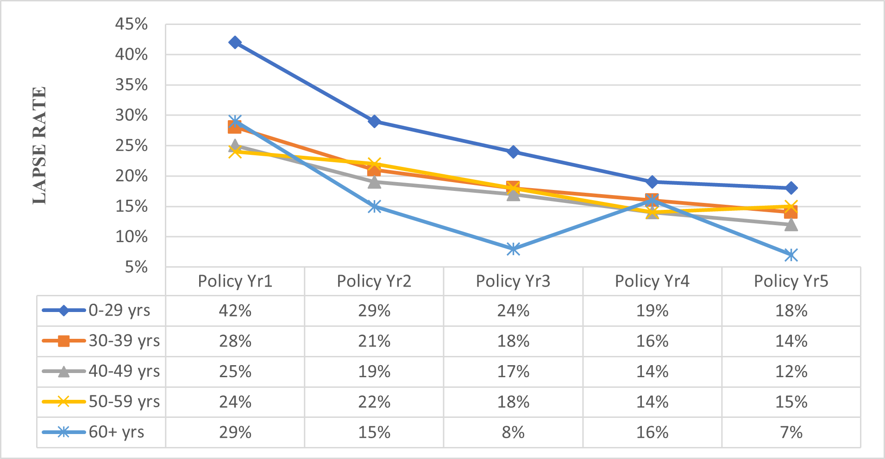
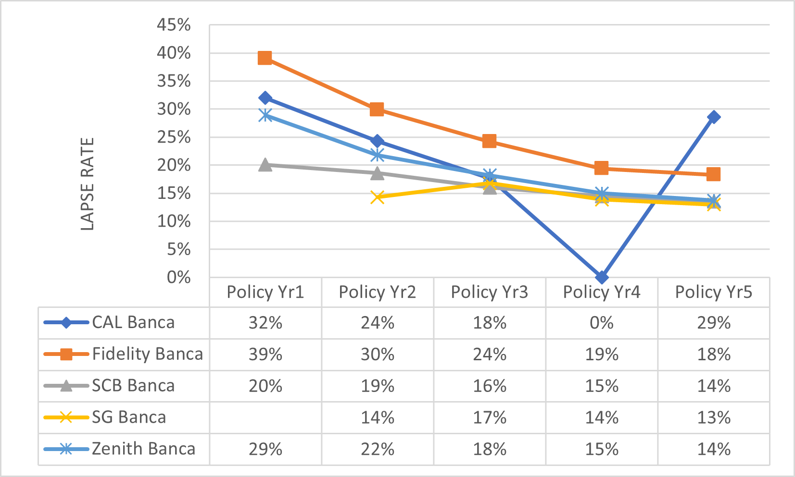
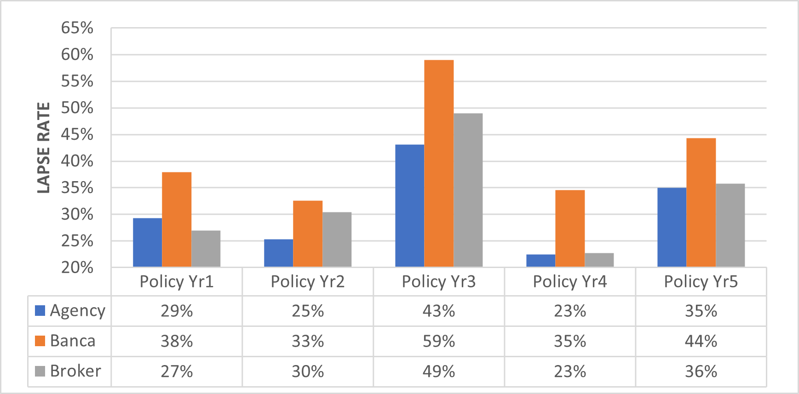
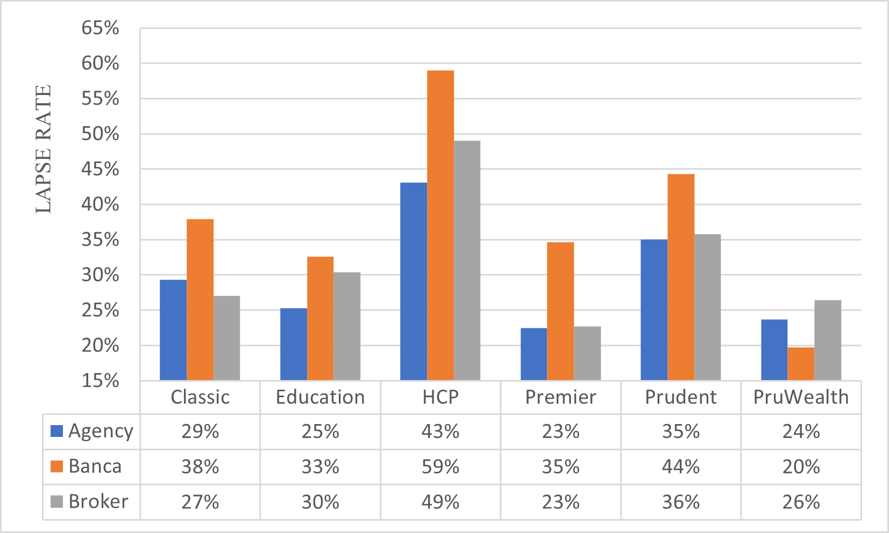
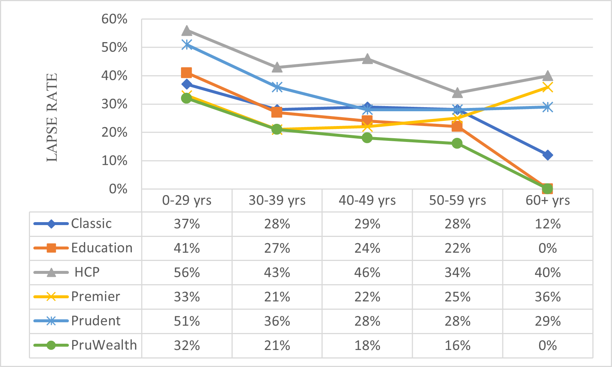
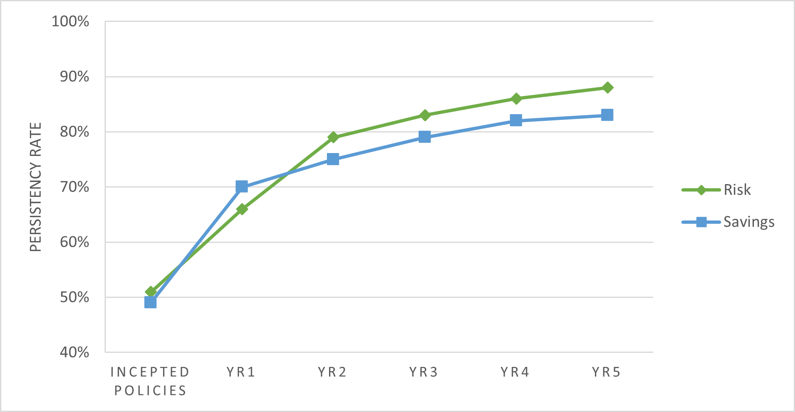
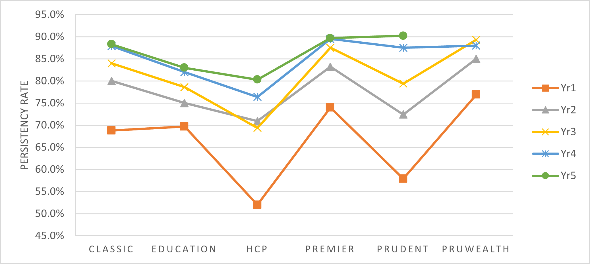

#  Insurance Analytics Case Study  
## Pricing & Experience Analysis (Actuarial Portfolio Project)

---

##  Executive Summary

This project presents a **comprehensive actuarial case study** combining:

-  **Pricing Model Development (UESP)**
-  **Lapse & Persistency Experience Analysis**

###  Objective:
To demonstrate how **pricing models and real-world experience data interact** to drive:
- Profitability  
- Risk management  
- Strategic decision-making  

---

##  Key Insights

- High lapse rates in early policy years reduce expected premium income  
- Younger policyholders exhibit significantly higher lapse risk  
- Banca channel shows weaker retention performance  
- Certain products (e.g., HCP) indicate potential mispricing  
- Persistency improves over time → long-term profitability potential  
---

# PART 1: Actuarial Pricing Model (UESP)

##  Model Overview

---

## Objectives

- Develop an Excel-based actuarial pricing model  
- Accurately calculate:
  - Risk premiums  
  - Total premiums  
- Ensure alignment between actuarial and IT systems  

---

##  Methodology

### Risk Premium Decomposition

RP = LS_RP + WoP_RP

Where:

LS = (Sum Assured / 1000) × Lump Sum Risk Rate

### Components:
- LS → Lump Sum benefit  
- WoP → Waiver of Premium  
- Multi-life coverage:
  - Main Life  
  - Spouse  
  - Child  
---

## IFRS 17 Alignment

The model reflects key IFRS 17 concepts:

- ✔ Fulfilment Cash Flows (future premiums & claims)  
- ✔ Risk Adjustment (via risk rates & scenarios)  
- ✔ Conceptual Contractual Service Margin (profit over time)  

---

## Results

- Improved pricing consistency and accuracy  
- Scenario-based premium calculations  
- Scalable framework for actuarial valuation  

---

## Business Impact

- Increased pricing accuracy → improved profitability  
- Reduced manual errors  
- Improved transparency for stakeholders  

---

# PART 2: Lapse & Persistency Analysis

---

## Lapse Rate by Age

**Insight:**
- Younger policyholders have highest lapse rates  
- Lapse decreases with age → increased stability  

---

## Lapse by Banca Channel

**Insight:**
- Banca channel shows highest lapse risk  
- Indicates weak customer retention mechanisms  

---

## Lapse by Distribution Channel

**Insight:**
- Agency performs best  
- Banca underperforms  

---

## Lapse by Policy Duration

**Insight:**
- Peak lapse occurs in Year 2–3  
- Critical retention window  

---

## Lapse by Product

**Insight:**
- HCP product shows highest lapse  
- Indicates pricing or product design issues  
---

##  Persistency Trends

### Overall Persistency

### Persistency by Product

**Insight:**
- Persistency improves over time  
- Long-term customers are more stable  
---

#  Integrated Actuarial Insights

This is the most critical component of the analysis.

### Key Relationships:

- High lapse → Reduced future premium income  
- Reduced persistency → Lower profitability  
- Mispriced products → Higher lapse rates  

### Critical Findings:

- Products with high lapse (e.g., HCP) may be:
  - Overpriced  
  - Poorly structured  
- Banca channel inefficiency affects:
  - Revenue stability  
  - Customer retention  

---

## Key Takeaway

> Pricing models must be continuously updated using real experience data (lapse & persistency) to ensure sustainable profitability.

---

# Strategic Recommendations

### 1. Early Retention Strategy
- Focus on Year 1–2 policies  
- Introduce loyalty incentives  

---

### 2. Pricing Adjustment
- Incorporate lapse assumptions into pricing  
- Reassess high-risk products  

---

### 3. Channel Optimization
- Strengthen Agency distribution  
- Improve Banca engagement  

---

### 4. IFRS 17 Readiness
- Extend model to:
  - Discounted cash flows  
  - Risk adjustment  
  - CSM calculation  
---

### 5. Data & Monitoring
- Build dashboards to track:
  - Lapse rates  
  - Persistency  
  - Profitability  
---

#  Tools & Techniques

- Excel (Actuarial Modeling)  
- Data Visualization  
- Experience Analysis  
- Scenario Testing  
---

#  Future Enhancements

- Predictive lapse modeling (Machine Learning)  
- Full IFRS 17 valuation engine  
- Power BI dashboard integration  

---
